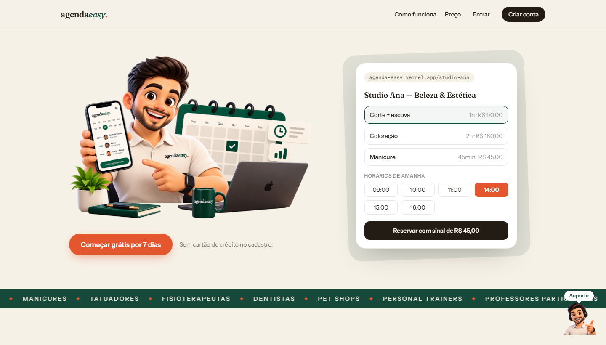
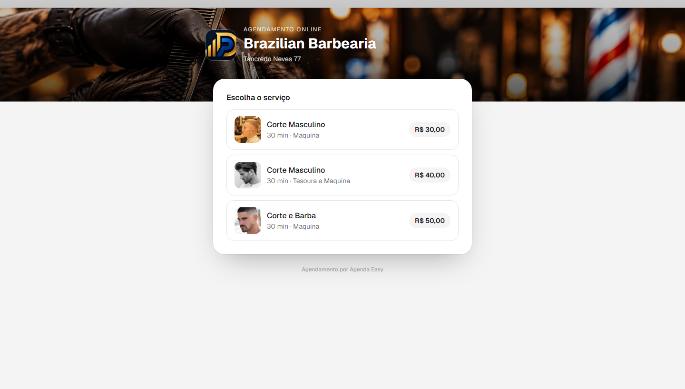

# Agenda Easy

**SaaS de agendamento online para qualquer serviço com hora marcada** — salões, barbearias, clínicas, personal trainers, professores, estúdios e o que mais atender com agenda. Cada negócio ganha uma página pública de reservas; o cliente escolhe serviço, profissional e horário e paga um **sinal de 50% via Pix** — a agenda só bloqueia para quem pagou.

🔗 **Produção:** [agenda-easy.vercel.app](https://agenda-easy.vercel.app)



## Como funciona

1. **O dono do negócio** cria a conta (e-mail/senha ou **Google**), cadastra serviços (preço, duração, foto), equipe e horários no painel.
2. **Publica a página** e divulga o link (`agenda-easy.vercel.app/seu-negocio`) no Instagram/WhatsApp.
3. **O cliente** escolhe serviço → profissional → horário, informa nome/telefone (e e-mail opcional) e recebe a chave Pix para pagar o **sinal de 50%**.
4. **O dono confirma** o Pix recebido no painel; o horário some da página pública e entra no calendário. Cliente recebe confirmação por e-mail e **lembrete automático 24h antes**.



## Funcionalidades

### Página pública `/{slug}`
- Identidade do negócio: logo, cor da marca, endereço e WhatsApp
- **Capa editável estilo Facebook** com regulagem de enquadramento (prévia ao vivo nas Configurações)
- Serviços com foto, preço e duração; escolha de profissional (com foto)
- Grade de horários em slots de 30 min — mostra **apenas horários realmente livres**
- Reserva com sinal de 50% via Pix + botão de WhatsApp com mensagem pronta
- **Cancelamento pelo cliente** via link secreto (até 2h antes do horário)

### Painel `/app`
- **Calendário mensal** com contadores por dia (confirmados × aguardando sinal × dias vagos) + agenda do dia
- Confirmação de sinal (Pix), conclusão, falta e cancelamento por agendamento
- Serviços, equipe (turnos criados automaticamente), horários e pausas (gerais ou por profissional)
- **Relatórios mensais**: receita prevista, sinais recebidos, status e serviços mais agendados
- Upload de fotos (logo, serviços e profissionais) via Supabase Storage

### Plataforma
- Login com **Google** ou e-mail/senha, recuperação de senha e mostrar/ocultar senha
- E-mails transacionais (**Resend**): confirmação de reserva, lembrete 24h (cron diário) e aviso de cancelamento
- **Chatbot de suporte** flutuante com respostas humanizadas e fallback para WhatsApp
- Assinatura do SaaS via **Asaas**: Plano Único R$ 49,90/mês, 7 dias grátis, bloqueio automático após o trial, reativação via webhook de pagamento — resiliente à geração assíncrona de faturas e a ids órfãos de sandbox
- **Instalável como app** (PWA): ícone e nome "AgendaEasy" ao salvar na tela inicial, abre em tela cheia
- Landing com animações GSAP (scroll), menu sticky, Open Graph e SEO
- **100% responsivo** — todas as telas auditadas em viewport mobile (0px de overflow; script em `scripts/shots-mobile.mjs`)

## Segurança

Auditada em 2026-10-07 (foco em vazamento de PII) — achados corrigidos e validados em produção:

- **RLS em todas as tabelas** — dados de clientes (nome, telefone, e-mail) visíveis apenas para membros do negócio; acesso anônimo a `businesses` restrito **por coluna** (`pix_key`/`phone` inacessíveis via PostgREST)
- **Chave Pix nunca exposta** no HTML público — só é entregue na resposta da própria reserva
- **E-mail do cliente pertence à reserva** (não ao cadastro por telefone) — impede desvio de lembretes/cancelamento por terceiros; reservas não sobrescrevem o nome de clientes existentes
- Valores de reserva sempre **recalculados no servidor**; sinal aceito somente via Pix também na API
- Tokens de cancelamento validados **no banco**; webhooks e cron autenticados (fail-closed)
- Headers de segurança (HSTS, X-Frame-Options, nosniff, Referrer-Policy, Permissions-Policy)
- Storage com policies por negócio (só o gestor grava na própria pasta); e-mails com escape de HTML por padrão; logs sem PII

## Stack

| Camada | Tecnologia |
|---|---|
| Framework | **Next.js 16** (App Router, Server Components/Actions, Turbopack) |
| UI | React 19 · Tailwind CSS 4 · GSAP (scroll) · fontes Fraunces/Instrument Sans |
| Backend | Supabase (Postgres + Auth + RLS + Storage) |
| Pagamentos | Asaas (assinatura do SaaS) · Pix direto do negócio (sinal das reservas) |
| E-mails | Resend (domínio verificado) |
| Infra | Vercel (deploy via GitHub + cron diário de lembretes) |
| Validação | Zod em todas as entradas |

## Estrutura

```
src/
├── app/
│   ├── page.tsx               # Landing (estática, GSAP, chatbot)
│   ├── [slug]/                # Página pública de agendamento
│   ├── cancelar/[id]/         # Cancelamento pelo cliente (token secreto)
│   ├── login/ · signup/ · esqueci-senha/ · redefinir-senha/
│   ├── auth/callback/         # OAuth Google + links de recuperação
│   ├── termos/ · privacidade/
│   ├── app/                   # Painel (agenda+calendário, serviços, equipe,
│   │                          #   horários, relatórios, configurações, billing)
│   └── api/
│       ├── public/            # availability + bookings (recalcula tudo no servidor)
│       ├── webhooks/asaas/    # Ativa/bloqueia assinatura por pagamento
│       └── cron/reminders/    # Lembrete 24h (Vercel Cron, diário)
├── components/                # auth-form, support-chat, scroll-bubbles
├── lib/
│   ├── availability/          # Motor de slots (horários ∩ turnos − pausas − reservas)
│   ├── billing/               # Plano, trial e política de acesso
│   ├── notifications/         # E-mails Resend (escape por padrão)
│   ├── storage.ts             # Upload/URL de mídia pública
│   └── asaas/ · supabase/ · money/ · dates/ · validation/
└── types/database.ts
supabase/
├── migrations/                # Schema completo (10 migrations, RLS + Storage)
├── config.toml                # Auth (Google, SMTP, senha mínima) — aplicar com config push
└── seed.sql                   # Barbearia demo para desenvolvimento local
scripts/e2e.mjs                # Teste E2E (Playwright) — local ou produção
```

## Rodando localmente

Pré-requisitos: Node 20+, Docker (Supabase local).

```bash
npm install
npx supabase start            # Postgres + Auth locais (migrations + seed)
cp .env.example .env.local    # preencha com as chaves exibidas pelo supabase start
npm run dev                   # http://localhost:8888
```

Página demo do seed: `http://localhost:8888/barbearia-demo`.

### Variáveis de ambiente

| Variável | Descrição |
|---|---|
| `NEXT_PUBLIC_SUPABASE_URL` / `NEXT_PUBLIC_SUPABASE_ANON_KEY` | Projeto Supabase |
| `SUPABASE_SECRET_KEY` | Service role — somente servidor |
| `ASAAS_API_KEY` / `ASAAS_BASE_URL` | Asaas (⚠️ chave começa com `$` → escapar como `\$` no `.env.local`) |
| `ASAAS_WEBHOOK_TOKEN` | Valida o header `asaas-access-token` do webhook |
| `RESEND_API_KEY` / `EMAIL_FROM` | E-mails transacionais (remetente de domínio verificado) |
| `CRON_SECRET` | Autentica o cron de lembretes (obrigatório) |
| `NEXT_PUBLIC_SITE_URL` | URL canônica (metadados/OG) |
| `SUPABASE_AUTH_EXTERNAL_GOOGLE_CLIENT_ID` / `_SECRET` | Login Google — aplicar com `npx supabase config push` |

## Testes

```bash
node scripts/e2e.mjs                                      # contra o dev local
E2E_BASE=https://agenda-easy.vercel.app E2E_SKIP_BILLING=1 node scripts/e2e.mjs   # produção (sem cobrar)
node scripts/shots-mobile.mjs                             # auditoria visual mobile (390px)
```

O E2E cobre o fluxo completo: conta → onboarding → serviço → equipe → horários → publicação → reserva pública → confirmação do sinal → agenda → assinatura Asaas → webhook → assinatura ativa. Com `E2E_EMAIL=...` também valida os e-mails transacionais. ⚠️ Em produção use sempre `E2E_SKIP_BILLING=1` — a Asaas real gera cobrança de verdade.

## Deploy

1. **Supabase**: `npx supabase link` → `npx supabase db push` → `npx supabase config push`
2. **Vercel**: conecte o repositório e configure as variáveis acima (o cron de lembretes vem do `vercel.json`)
3. **Asaas**: cadastre o webhook `https://SEU-DOMINIO/api/webhooks/asaas` com o token e eventos de pagamento
4. **Google**: OAuth Web com redirect `https://SEU-PROJETO.supabase.co/auth/v1/callback`

## Licença

[MIT](LICENSE) © Kallebe Siqueira · Desenvolvido por [Digital Paulo Afonso](https://digitalpauloafonso.com.br)
