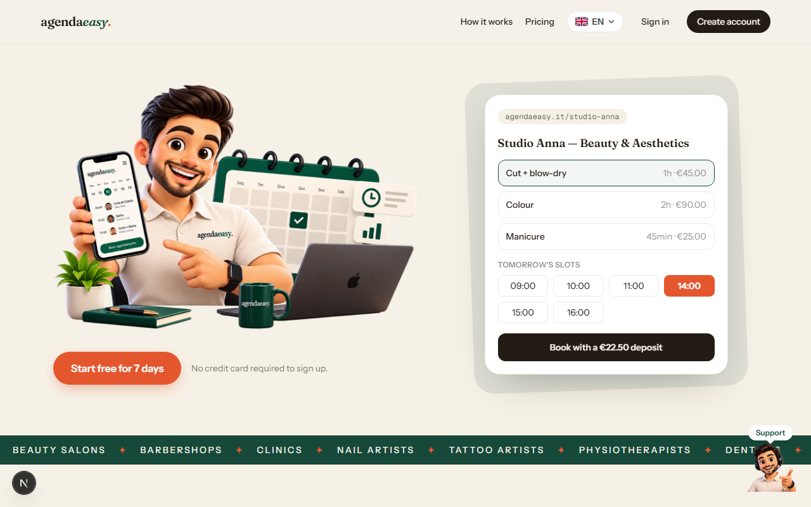
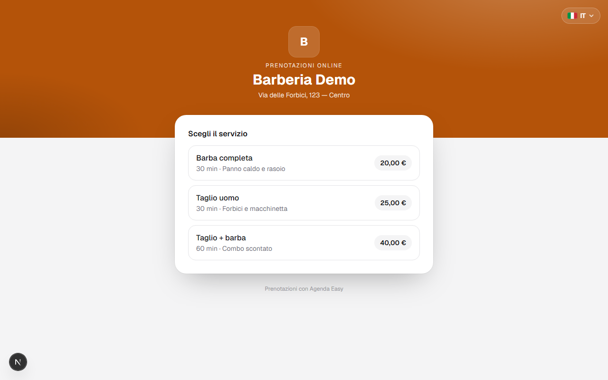
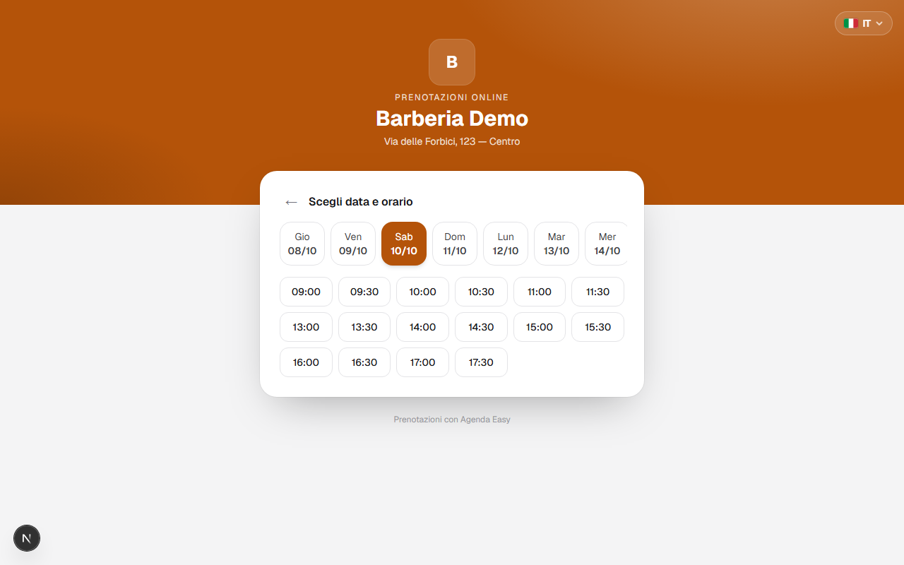
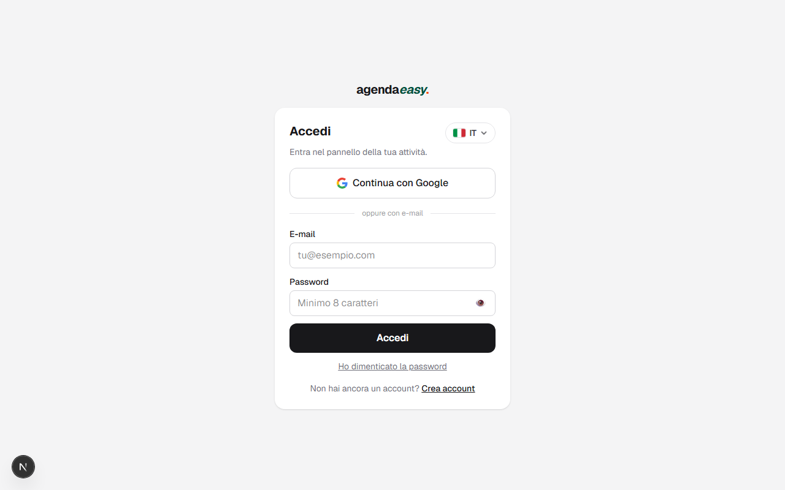
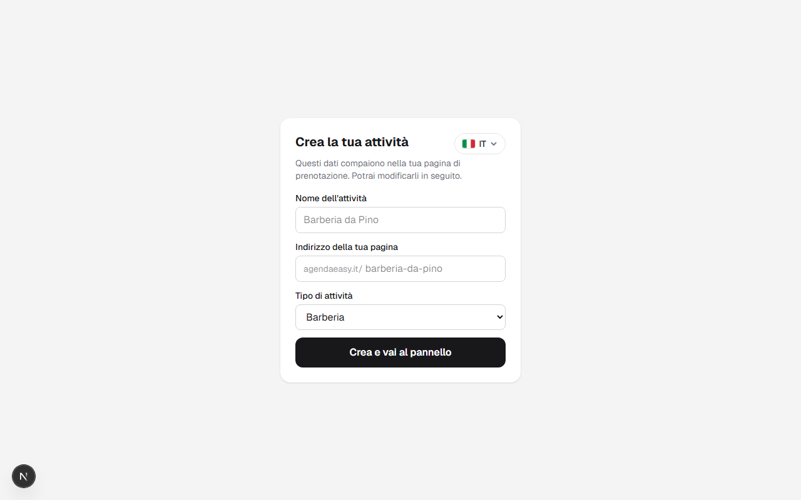
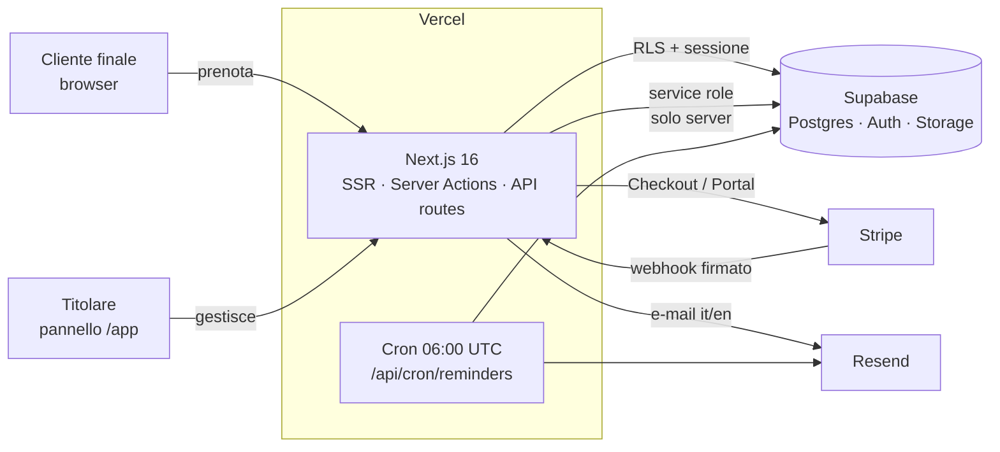
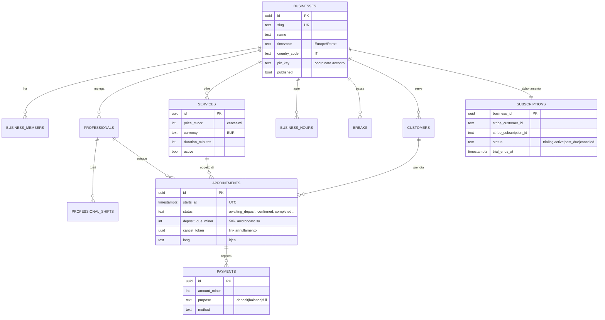
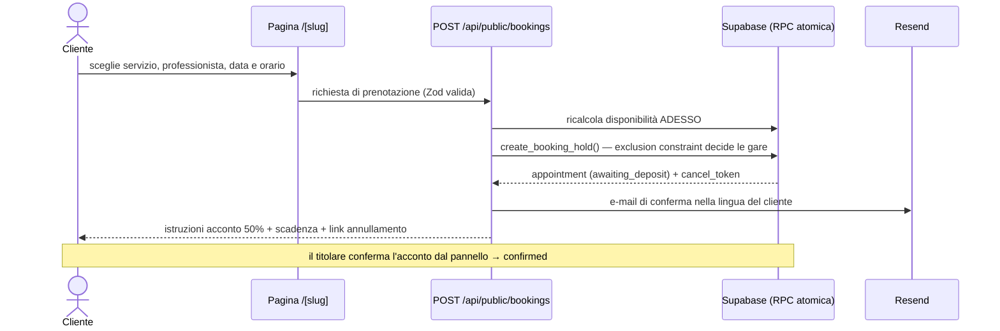

# Agenda Easy 🇮🇹

> **Agenda piena, WhatsApp in pace.** SaaS di prenotazioni online con acconto del 50% per qualsiasi attività su appuntamento — barberie, saloni, estetiste, tatuatori, fisioterapisti e altro.


Il cliente sceglie servizio, professionista e orario da solo, versa un **acconto del 50%** direttamente all'attività e l'agenda si organizza da sé. Interfaccia **bilingue (italiano/inglese)**, valuta **EUR**, fuso **Europe/Rome**.

---

## 🎥 Demo

**[▶ Guarda il video demo](docs/media/demo.webm)** — landing, cambio lingua, flusso di prenotazione e onboarding.

| Landing (italiano) | Landing (inglese) |
|---|---|
|  |  |

| Pagina pubblica di prenotazione | Scelta dell'orario |
|---|---|
|  |  |

| Accesso | Onboarding dell'attività |
|---|---|
|  |  |

---

## ✨ Funzionalità

- **Pagina pubblica personalizzata** per ogni attività (`agendaeasy.it/tua-attivita`): logo, copertina, colore del brand, servizi con foto
- **Acconto del 50% contro i no-show**: la prenotazione blocca l'orario solo per un tempo limitato; chi paga, si presenta
- **Agenda del giorno + calendario mensile** nel pannello, con stati (in attesa di acconto, confermata, completata, annullata, no-show)
- **Team e turni per professionista**, orari di apertura reali e pause (es. pranzo)
- **Report mensile**: ricavi previsti, acconti ricevuti, servizi più prenotati
- **E-mail transazionali** (conferma + promemoria 24h) nella lingua del cliente, con link di annullamento sicuro (fino a 2h prima)
- **Abbonamento SaaS via Stripe**: Checkout (9,90 €/mese, 7 giorni di prova), webhook del ciclo di vita, Customer Portal
- **Bilingue it/en** con selettore 🇮🇹/🇬🇧 persistente (cookie, 1 anno) su tutte le pagine — e-mail comprese
- **Accesso con Google** o e-mail/password (Supabase Auth)

## 🧱 Stack

| Livello | Tecnologia |
|---|---|
| Frontend + Backend | Next.js 16 (App Router, Server Components, Server Actions, Turbopack) |
| UI | React 19 · Tailwind CSS 4 · GSAP |
| Database / Auth / Storage | Supabase (Postgres 17 + RLS, Auth, Storage) |
| Pagamenti | Stripe (Checkout subscription, Webhooks, Customer Portal) |
| E-mail | Resend |
| Validazione | Zod (ogni mutazione validata sul server) |
| Hosting | Vercel (incluso cron giornaliero dei promemoria) |

## 🗺️ Architettura



## 📐 UML

### Modello dati (ER)



### Sequenza: prenotazione pubblica



### Sequenza: abbonamento Stripe

```mermaid
sequenceDiagram
    actor T as Titolare
    participant B as /app/billing (Server Action)
    participant S as Stripe
    participant W as /api/webhooks/stripe
    participant DB as Supabase

    T->>B: "Abbonati ora"
    B->>S: Checkout Session (subscription, trial residuo)
    S-->>T: pagina di pagamento Stripe
    T->>S: paga (carta, SEPA, ...)
    S->>W: checkout.session.completed / invoice.paid (firma verificata)
    W->>DB: subscriptions.status = active
    Note over T,DB: rinnovi, insoluti e disdette arrivano via webhook;<br/>la gestione self-service passa dal Customer Portal
```

## 📂 Struttura del progetto

```
src/
├── app/
│   ├── page.tsx              # landing bilingue
│   ├── [slug]/               # pagina pubblica di prenotazione
│   ├── annulla/[id]/         # annullamento via cancel_token
│   ├── app/                  # pannello (agenda, servizi, team, orari, report, impostazioni)
│   │   └── billing/          # abbonamento Stripe (checkout + portal)
│   └── api/
│       ├── public/           # disponibilità + prenotazioni (server = autorità)
│       ├── webhooks/stripe/  # ciclo di vita dell'abbonamento
│       └── cron/reminders/   # promemoria 24h (Vercel Cron)
├── components/               # selettore lingua, chat di supporto, form auth
└── lib/
    ├── i18n/                 # it/en via cookie (server + client + messaggi actions)
    ├── availability/         # motore slot (turni ∩ orari − pause − occupati)
    ├── billing/              # piano, trial, politica di accesso
    ├── dates/ money/         # Intl it-IT/en-GB, EUR in centesimi
    └── supabase/ stripe/     # client tipizzati (session / admin / stripe)
supabase/migrations/          # schema completo + RLS + hardening (13 migrazioni)
```

## 🚀 Avvio locale

```bash
npm install
cp .env.example .env.local    # compila le chiavi (vedi tabella)
npx supabase link --project-ref <ref> && npx supabase db push
npm run dev                   # http://localhost:7778
```

| Variabile | Descrizione |
|---|---|
| `NEXT_PUBLIC_SUPABASE_URL` / `NEXT_PUBLIC_SUPABASE_ANON_KEY` | progetto Supabase |
| `SUPABASE_SECRET_KEY` | service role — solo server |
| `NEXT_PUBLIC_SITE_URL` | `https://agendaeasy.it` in produzione |
| `STRIPE_SECRET_KEY` / `STRIPE_PRICE_ID` / `STRIPE_WEBHOOK_SECRET` | abbonamento SaaS |
| `RESEND_API_KEY` / `EMAIL_FROM` | e-mail transazionali |
| `CRON_SECRET` | protegge il cron dei promemoria |

Webhook Stripe in locale: `stripe listen --forward-to localhost:7778/api/webhooks/stripe`

## 🔒 Sicurezza

- **RLS per tenant** su ogni tabella + grant a colonne per `anon` (le coordinate di pagamento e i telefoni non sono mai leggibili pubblicamente)
- **Il server è l'autorità**: prezzi, durate e disponibilità ricalcolati sempre lato server; prenotazioni concorrenti risolte da un exclusion constraint Postgres
- **Webhook Stripe** verificato sulla firma del body raw, fail-closed senza secret
- **Annullamento** autenticato da token segreto per prenotazione, con limite 2h
- Header di sicurezza (HSTS, X-Frame-Options, nosniff, Referrer-Policy, Permissions-Policy)

## 🗺️ Roadmap

Consulta le [Issues](../../issues) per la roadmap: IVA automatica con Stripe Tax, rate limiting, CSP, test E2E in CI e altro.

## 📄 Licenza

[MIT](LICENSE) — Sviluppato da **[Kallebe Gallo](https://github.com/kallebesiqueira-dev)**
